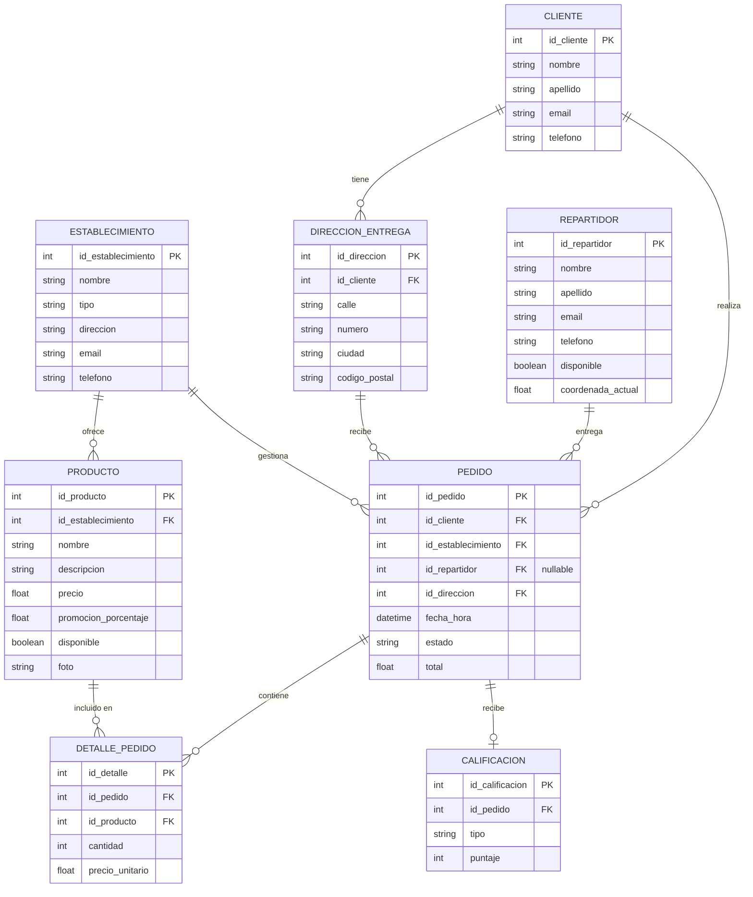

# Rappi data console

Trabajo practico de Ingenieria de Datos II. La app simula una operatoria tipo Rappi y sirve para consultar/renderizar datos repartidos entre varias bases cloud.

La prioridad actual es dejar asentada la arquitectura, el modelo de datos por
motor y el flujo de consumo para despues avanzar con pantallas e integraciones
reales sin rediscutir decisiones base.

## Funcionamiento

La aplicacion esta separada por rol:

- `/admin`: duenio/gestor de establecimiento. Ve establecimientos, productos, pedidos y analiticas.
- `/repartidor`: repartidor. Ve perfil operativo, disponibilidad, ubicacion y pedidos asignados.
- `/usuario`: consumidor final. Ve perfil, establecimientos, pedidos propios y direcciones.

No hay ruta navegable `/clientes`. El cliente existe como dato interno del usuario consumidor.

## Stack

- Next.js 16 App Router
- React 19
- TypeScript
- pnpm
- Tailwind CSS 4
- shadcn/ui
- Hugeicons

## Bases de datos

| Motor                       | Uso en el sistema                                                                                |
| --------------------------- | ------------------------------------------------------------------------------------------------ |
| Supabase/PostgreSQL         | Entidades del DLR: establecimientos, productos, pedidos, clientes, repartidores, calificaciones. |
| MongoDB Atlas               | Proyecciones documentales: catalogos enriquecidos, perfiles, snapshots de pedidos, reviews y actividad. |
| Redis/Upstash               | Estado vivo: repartidores disponibles, ubicacion actual, cache de estado de pedidos.             |
| Cassandra/DataStax Astra DB | Eventos historicos de pedidos y tracking de entregas.                                            |

El DLR define el dominio conceptual. Para la implementacion NoSQL, los datos se pueden desnormalizar segun patrones de acceso.

Detalle de almacenamiento y consumo: [`docs/MODELO_DATOS.md`](docs/MODELO_DATOS.md).
Gaps actuales y roadmap: [`docs/GAPS.md`](docs/GAPS.md).

Modelos fisicos:

- [`docs/POSTGRES_MODELO_FISICO.md`](docs/POSTGRES_MODELO_FISICO.md)
- [`docs/CASSANDRA_MODELO_FISICO.cql`](docs/CASSANDRA_MODELO_FISICO.cql)
- [`docs/MONGODB_MODELO_FISICO.md`](docs/MONGODB_MODELO_FISICO.md)
- [`docs/REDIS_MODELO_FISICO.md`](docs/REDIS_MODELO_FISICO.md)

## Flujo de datos

```txt
Server Component async
  -> lib/db/<motor>/queries
  -> QueryResult<T>
  -> props hacia Client Component
  -> render con shadcn/ui
```

Reglas:

- No consultar DB desde Client Components.
- No usar Redux/Zustand/store global.
- No crear endpoints HTTP internos para lecturas si alcanza con Server Components.
- `app/api` queda para webhooks, integraciones externas, exports o health checks.
- Cada query devuelve `QueryResult<T>` y maneja errores sin lanzar excepciones a la UI.

## Rutas base

```txt
app/
├── admin/
│   ├── page.tsx
│   ├── establecimientos/
│   ├── productos/
│   ├── pedidos/
│   └── analytics/
├── repartidor/
│   ├── page.tsx
│   ├── pedidos/
│   └── disponibilidad/
└── usuario/
    ├── page.tsx
    ├── establecimientos/
    ├── pedidos/
    └── direcciones/
```

Las paginas de detalle usan ids:

```txt
/admin/establecimientos/[idEstablecimiento]
/admin/productos/[idProducto]
/admin/pedidos/[idPedido]
/repartidor/pedidos/[idPedido]
/usuario/establecimientos/[idEstablecimiento]
/usuario/pedidos/[idPedido]
```

Estado actual: estan implementadas `/`, `/admin`, `/admin/establecimientos`,
`/repartidor`, `/repartidor/disponibilidad` y `/usuario`. El resto son rutas
planificadas para completar incrementalmente.

## Modo mock

Mientras no esten conectadas las DB reales, las queries usan mocks por defecto.

```env
MOCK_DB=true
```

Para usar credenciales reales:

```env
MOCK_DB=false
```

Los mocks viven junto a cada motor:

```txt
lib/db/postgres/mock.ts
lib/db/mongodb/mock.ts
lib/db/cassandra/mock.ts
```

## Comandos

```bash
pnpm install
pnpm dev
pnpm typecheck
pnpm lint
pnpm build
```

## DLR



## Documentacion interna

- **`AGENTS.md`**: fuente de verdad para agentes de IA y colaboradores. Reglas obligatorias, estado del repo, patrones y checklist.
- `docs/ARQUITECTURA.md`: estructura, rutas, motores y flujo de datos.
- `docs/MODELO_DATOS.md`: que dato vive en que motor y como se consume.
- `docs/GAPS.md`: pendientes para pasar de base documental a produccion.
- `docs/DECISIONES.md`: ADRs del proyecto.
