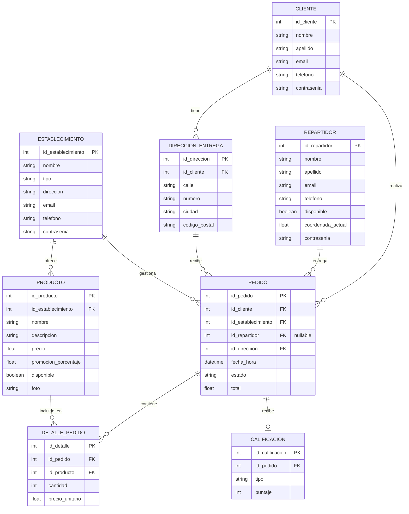

# Diagrama lógico relacional (DLR)

Diagrama en [Mermaid](https://mermaid.js.org/syntax/entityRelationshipDiagram.html) (`erDiagram`). Renderizable en GitHub, Obsidian o editores con soporte Mermaid.

## Entidades

| Entidad | Descripción |
|---------|-------------|
| `ESTABLECIMIENTO` | Comercio que publica productos y recibe pedidos |
| `PRODUCTO` | Ítem del catálogo de un establecimiento |
| `CLIENTE` | Usuario consumidor |
| `DIRECCION_ENTREGA` | Direcciones asociadas a un cliente |
| `REPARTIDOR` | Repartidor asignable a pedidos |
| `PEDIDO` | Orden; `id_repartidor` opcional hasta asignación |
| `DETALLE_PEDIDO` | Líneas de un pedido (producto, cantidad, precio) |
| `CALIFICACION` | Valoración ligada a un pedido (0..1 por pedido) |

## Cardinalidades (resumen)

- Un establecimiento tiene muchos productos y muchos pedidos.
- Un cliente tiene muchas direcciones y muchos pedidos.
- Un repartidor puede entregar muchos pedidos.
- Una dirección puede usarse en muchos pedidos.
- Un pedido tiene muchos detalles; cada detalle referencia un producto.
- Un pedido puede tener como máximo una calificación.
